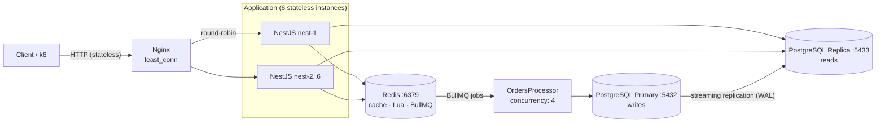
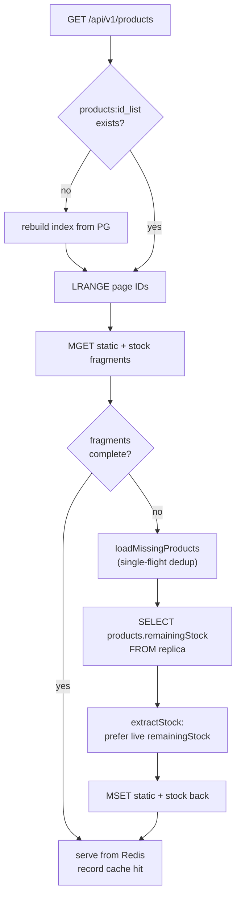

# Flash Sale System Architecture Summary

## System Flow at a Glance



### Read path (GET /products — cache-aside + lazy hydration)



### Write path (POST /orders — fast-fail → worker → compensation)

```mermaid
flowchart TD
    A["POST /api/v1/orders"] --> B["Lua fast-fail<br/>checks + DECR stock"]
    B -- "reject" --> R["409 / 429"]
    B -- "ok" --> C["enqueue BullMQ job"]
    C --> D["Worker pessimistic tx<br/>SELECT ... FOR UPDATE"]
    D --> E{"remainingStock<br/>&gt; 0?"}
    E -- "no" --> F["OUT_OF_STOCK<br/>rollback (no compensation)"]
    E -- "yes" --> G["UPDATE decrement + INSERT order"]
    G --> H{"COMMIT<br/>ok?"}
    H -- "yes" --> I["SUCCESS<br/>set sold-out flag if 0"]
    H -- "no" --> J["`failed` event<br/>(after all retries)"]
    J --> K["compensateFailedStock<br/>INCR once (marker key)"]
```

## 1. High-Level Architecture Overview

This backend is designed for a flash-sale workload where demand spikes to thousands of requests per second and the safe path is determined by Redis-first validation rather than expensive PostgreSQL reads or writes on the request hot path.

The architecture intentionally separates the read-heavy catalog path from the write-heavy order path:

- `ProductsService` handles the catalog and product lookup flow with an index-first cache strategy.
- `OrdersService` validates user intent and reserves stock using short-lived distributed locks and atomic Redis operations.
- `BootstrapperService` warms the product index at startup without preloading all static product detail fragments.
- Redis acts as the fast-fail and coordination layer, while PostgreSQL remains the durable source of truth for product inventory and order persistence.
- BullMQ workers execute the actual order persistence job after the request has already passed Redis-side validation.

### High-Concurrency Execution Model

Under high concurrency, the system avoids database contention through a layered pattern:

1. The app uses a compact Redis index of active flash-sale product IDs instead of scanning the entire PostgreSQL catalog for each request.
2. `ProductsService.findAll()` reads the index first, then lazily fetches only missing static/stock fragments for the requested page.
3. `OrdersService.create()` performs eager fast-fail checks before queueing work:
   - sold-out flag check
   - duplicate purchase check
   - per-user/per-product lock acquisition
   - atomic stock reservation using Redis `DECR`
4. If stock drops below zero, the system restores the counter and rejects the request with HTTP 409 Conflict.
5. Valid requests are enqueued to a BullMQ queue and processed asynchronously, where the worker performs the database write and records idempotency state.

This pattern keeps the API latency low, reduces pointless PostgreSQL work, and ensures that only safe, valid order attempts reach the queue.

### Service Responsibilities

#### OrdersService

`OrdersService` is the request gatekeeper for flash-sale purchases. It is responsible for:

- checking `product:soldout:{productId}` before processing
- checking `order:purchased:{userId}:{productId}` for duplicate purchases
- acquiring `order:lock:{userId}:{productId}` to serialize concurrent order attempts for the same user-product pair
- atomically decrementing `stock:{productId}` with Redis `DECR`
- rejecting oversold requests before the worker is even scheduled
- enqueueing a BullMQ job to persist the final order record

The service deliberately fails early with `409 Conflict` for invalid or oversold requests, which is critical when the write path is under extreme pressure.

#### ProductsService

`ProductsService` owns the product catalog read path and the cache hydration strategy:

- it relies on `products:id_list` as the active product index
- it reads paginated IDs from Redis rather than scanning PostgreSQL
- it uses `product:static:{productId}` and `stock:{productId}` as cache fragments
- it performs lazy hydration for missing fragments only
- it records cache hit and miss telemetry through Redis counters
- it rebuilds the index from PostgreSQL only when the cache is empty or missing

This creates a highly efficient cold-start and steady-state path: the system keeps the index small and hot, while richer product details are hydrated only when needed.

#### BootstrapperService

`BootstrapperService` runs during application startup and performs a lightweight startup warm-up. Instead of loading every product record and their fragments into Redis, it only populates the active flash-sale product ID list:

- query active flash-sale products from PostgreSQL
- store their IDs in `products:id_list`
- assign a short TTL to the key for cache freshness
- guard execution with `products:id_list:warmup_lock`

This is intentionally lightweight and keeps memory overhead minimal while preserving the ability to lazy-hydrate product fragments on demand.

---

## 2. Redis Cache Registry & Total Count (How many & Why)

The system uses 11 Redis keys/patterns for the flash-sale orchestration layer. Each one has a specific role in coordinating concurrency, failing fast, tracking telemetry, and invalidating stale product fragments.

| # | Redis key / pattern | Type | TTL / lifetime | Service(s) | Purpose |
|---|---|---|---|---|---|
| 1 | `products:id_list` | List | 1 hour | `BootstrapperService`, `ProductsService` | Active flash-sale product ID index used for paginated product reads and startup warm-up. |
| 2 | `product:static:{productId}` | String (JSON) | 24 hours | `ProductsService` | Immutable product details fragment, including name, description, price, and flash-sale flags. |
| 3 | `stock:{productId}` | String (integer) | 1 hour | `OrdersService`, `ProductsService` | Atomic inventory counter used for reservation and oversell prevention. DECR'd at the API layer; self-heals via hydration. |
| 4 | `product:soldout:{productId}` | String flag | 24 hours | `OrdersService` | Fast-fail flag for exhausted products; prevents further order attempts after oversubscription. |
| 5 | `order:purchased:{userId}:{productId}` | String flag | 24 hours | `OrdersService`, `OrdersProcessor` | Idempotency marker preventing the same user from purchasing the same product twice. |
| 6 | `order:lock:{userId}:{productId}` | String lock value | 60 seconds | `OrdersService`, `OrdersProcessor` | Distributed lock to serialize concurrent user/product order requests. |
| 7 | `products:id_list:warmup_lock` | String lock | 30 seconds | `BootstrapperService` | Singleton startup lock that prevents duplicate warm-up attempts across app instances. |
| 8 | `products:id_list:rebuild_lock` | String lock | 10 seconds | `ProductsService` | Concurrency control during index rebuilds when the Redis list is empty or missing. |
| 9 | `cache:hits:products` | Counter | No TTL | `ProductsService`, `RedisService` | Atomic success counter for product-fragment cache hits. |
| 10 | `cache:misses:products` | Counter | No TTL | `ProductsService`, `RedisService` | Atomic database fallback counter for actual product-fragment misses. |
| 11 | _(reserved)_ | — | — | — | Reserved for future admin-driven invalidation. Previously planned but never wired up — no caller exists for `RedisService.trackCacheKey`. Cache consistency for `stock:{productId}` is maintained via atomic DECR on every order. |

### Why these keys matter

Each key is selected to minimize expensive database round-trips while still maintaining correctness under concurrency. In practice:

- list keys keep the request path index-only and paginated
- static fragments avoid repeated PostgreSQL payload reads
- stock keys provide atomic `DECR` semantics for oversell protection
- sold-out and purchased flags make duplicate or exhausted requests fail immediately at the edge
- lock keys produce a short, local serialization boundary for the same user/product pair
- counters provide observability around cache efficiency
- tracked set enables targeted cache invalidation after inventory changes

---

## 3. Bootstrapper & Lazy-Loading Strategy

### Index-Only Warm-up

The system intentionally avoids a heavyweight Redis prepopulation step at startup. `BootstrapperService.onApplicationBootstrap()` acquires `products:id_list:warmup_lock` and performs a minimal query:

- select only the active flash-sale `productId` values
- store them in `products:id_list`
- set an expiry of 1 hour

This is called an index-only warm-up because it populates only the lightweight catalog index and deliberately does not hydrate full product detail fragments. This keeps startup time low, memory overhead modest, and prevents producing a large amount of hot data that might never be accessed.

The design also avoids the classic “warm cache but overfill memory” anti-pattern. Instead, the system maintains a compact list of active IDs and allows each read to fill only the exact fragments it needs.

### On-Demand Lazy Hydration

`ProductsService.findAll()` begins by ensuring the active product ID index exists. If the list is empty, it rebuilds it through `rebuildActiveProductIdIndex()` using a short-lived lock (`products:id_list:rebuild_lock`).

After the IDs are available, the service slices the page, fetches Redis fragments for each ID, and checks for missing values:

- `product:static:{productId}` missing or invalid JSON
- `stock:{productId}` missing

Any missing product fragments trigger `fetchMissingProductsFromDb()`, which:

- deduplicates concurrent cold-start requests via a single-flight map
- queries PostgreSQL only for the exact missing IDs
- writes back static and stock fragments to Redis
- records precise per-product cache misses using `cache:misses:products`

This strategy is especially effective under cold starts or during burst traffic because it prevents the thundering-herd problem where thousands of requests all hit the database for the same missing product fragments. The service collapses those requests into one DB fallback and then shares the hydrated values across the burst.

### Telemetry and Cache Efficiency

The system tracks cache efficiency with atomic counters:

- `cache:hits:products` increments when the fragment set is complete and the product data is served from Redis
- `cache:misses:products` increments when a previously cold product fragment is loaded from PostgreSQL

The design records misses by distinct missing product count instead of by request count, which makes the telemetry far more representative of real cache behavior under bursts and batched reads.

---

## 4. Resiliency & Order Processing (Job Fail Handling)

### Fast-Fail Validation Before Queueing

The order flow is intentionally front-loaded with Redis-based validation so that invalid or oversold requests do not reach the worker.

`OrdersService.create()` begins with explicit checks:

1. `product:soldout:{productId}`: if present, return HTTP 409 Conflict
2. `order:purchased:{userId}:{productId}`: if present, return HTTP 409 Conflict
3. `order:lock:{userId}:{productId}`: if another request holds the distributed lock, return HTTP 409 Conflict
4. `stock:{productId}` via atomic `DECR`: if the result becomes negative, restore the value, mark the product sold out, remove the lock, and return HTTP 409 Conflict

This means oversubscribed or duplicate requests are rejected before the queue is even used. The queue therefore sees only valid order candidates, which keeps the worker pipeline clean and failure-free.

### Atomic Guard Pattern

The critical integrity rule is:

- stock is decremented only once per valid order attempt
- if the stock drops below zero, it is immediately restored
- the sold-out marker is set for the product
- the lock is released

This guarantees that the system cannot admit more orders than inventory permits, even under intense concurrent access.

### BullMQ Worker Execution

Once Redis validation passes, the request is enqueued with BullMQ:

- job data includes `userId`, `productId`, and optional trace ID
- the worker runs with bounded concurrency
- it checks whether the user already purchased the product
- it performs a PostgreSQL update constrained by `remainingStock > 0`
- it records the order status and stores the purchase marker
- it invalidates product cache fragments after success

This creates a stable execution pipeline:

- Redis handles the edge rejection and coordination
- BullMQ handles durable asynchronous processing
- PostgreSQL persists the final order and inventory adjustments
- cache invalidation refreshes the product fragments after a successful order

### Failure Handling Philosophy

The system treats job failures as data integrity events rather than silent recoveries:

- if a job is already purchased, it is skipped
- if the database update fails because stock is exhausted, it is logged and marked as failure
- if a duplicate row violation occurs, the worker compensates and rolls back the stock increment
- if the failure is transient, it is surfaced as a real job failure instead of being misclassified as a duplicate purchase

This makes the overall architecture resilient: the API remains fast, Redis remains the primary guardrail, and the async worker performs the expensive but reliable write operations without polluting the hot request path.

---

## 5. Inventory Correctness Fixes (Hydration & Counter Drift)

### 5.1 Bug 1 — Read-path hydration returned initial stock instead of live stock

**Root cause:** `ProductsService.extractStock()` returned
`record.availableStock ?? record.remainingStock ?? fallback ?? 0`. Because
`availableStock` (the initial total) is always populated, the `remainingStock`
branch was effectively dead code — so a Redis cache miss rehydrated the stock
counter with the **initial total** rather than the live remaining value. Under
high concurrency this reintroduced oversell risk.

**Fix:** `extractStock()` now prefers the live value in this order:

1. `record.remainingStock` (maintained by the worker's pessimistic PG transaction)
2. `fallback` (the already-cached stock fragment, if any)
3. `record.availableStock` (initial total) — last resort only

```ts
private extractStock(record, fallback): number | null {
  if (record && typeof record === 'object') {
    const remaining = Number(record.remainingStock ?? record['remainingStock'] ?? NaN);
    if (Number.isFinite(remaining) && remaining >= 0) return remaining;

    const fallbackValue = Number(fallback ?? NaN);
    if (Number.isFinite(fallbackValue) && fallbackValue >= 0) return fallbackValue;

    const total = Number(record.availableStock ?? NaN);
    if (Number.isFinite(total) && total >= 0) return total;
  }
  if (fallback != null) return Number(fallback);
  return null;
}
```

`fetchMissingProductsFromDb()` already selects `remainingStock` and writes it
back via `stockValue = Number(row.remainingStock ?? row.availableStock ?? 0)` —
only `extractStock` was discarding the live value. The rehydrated Redis value now
matches the PostgreSQL source of truth.

### 5.2 Bug 2 — Redis counter drift on worker failure (ghost sold-out)

**Root cause:** the API's Lua fast-fail `DECR`s `stock:{id}` *before* enqueueing.
If the worker later failed (rollback, validation error, crash), there was no
compensating `INCR`, so Redis drifted permanently below PostgreSQL and made items
appear sold out despite available DB stock.

**Fix:** two coordinated changes:

**a) `RedisService.compensateFailedStock()`** — an idempotent one-time `INCR`
guarded by an `NX` marker key:

```ts
async compensateFailedStock(stockKey, restoreKey, ttlSeconds = 24 * 60 * 60): Promise<number> {
  const script = `
    if redis.call('SET', KEYS[2], '1', 'NX', 'EX', ARGV[1]) then
      return redis.call('INCR', KEYS[1])
    end
    return 0
  `;
  const result = (await this.client.eval(script, 2, stockKey, restoreKey, String(ttlSeconds))) as unknown;
  return Number(result ?? 0);
}
```

The marker key (`restoreKey`) makes the increment happen **exactly once** per
failed job, even across retries, duplicate `failed` events, or cross-instance
races.

**b) `OrdersProcessor.onJobFailed()`** — hooked to the BullMQ `failed` event,
which fires **once per job after all `attempts` are exhausted** (not per attempt,
which would over-compensate if a retry later succeeded):

```ts
@OnWorkerEvent('failed')
async onJobFailed(job: Job<OrderJobData>, error: Error): Promise<void> {
  const { userId, productId } = job.data;
  const stockKey = `stock:${productId}`;
  const restoreKey = `order:stock:restore:${job.id ?? `${userId}:${productId}`}`;

  // OUT_OF_STOCK: PG was already zero before the job ran, so there is nothing
  // to compensate — and the worker already set the sticky sold-out flag.
  // Restoring here would push Redis above zero and defeat the sold-out fast-fail.
  if (error?.message === 'OUT_OF_STOCK') {
    this.logger.warn({ jobId: job.id, userId, productId }, 'job failed with OUT_OF_STOCK; skipping stock compensation');
    return;
  }

  const restored = await this.redis.compensateFailedStock(stockKey, restoreKey, 24 * 60 * 60);
  if (restored > 0) {
    this.logger.warn({ jobId: job.id, userId, productId, restoredTo: restored }, 'compensated Redis stock for failed order job');
  }
}
```

**Why `failed` event, not the `process()` catch:** the queue uses `attempts: 2`.
Compensating in `process()`'s catch would `INCR` on every retry attempt and
double-restore if a later retry succeeded. The `failed` event fires exactly once
after all attempts are exhausted, making the compensation semantically correct.

**Why skip `OUT_OF_STOCK`:** when PostgreSQL is already at zero there is no rolled
back decrement to compensate, and the in-tx logic has already set the sticky
sold-out flag. Compensating here would push Redis back above zero and flood the
queue with wasted jobs.

### 5.3 Verification strategy

1. **Hydration:** assert `extractStock({ availableStock: 100, remainingStock: 37 }) === 37`, and that `availableStock` is only used when `remainingStock` is absent.
2. **Compensation idempotency:** after a simulated `DECR` (10 → 9) and worker failure, assert `compensateFailedStock` returns `10` on the first call and `0` on the second, leaving the counter at `10`.
3. **Failure integration:** force a worker failure (e.g. `23505` duplicate rollback after a successful `DECR`), confirm the `failed` log line and that `stock:{id}` in Redis equals `remainingStock` in PostgreSQL, with repeated `failed` events not inflating the counter.

---

## System Summary

The architecture combines three complementary mechanisms to sustain flash-sale traffic under high concurrency:

- Redis fast-fail checks prevent invalid requests from reaching the queue
- atomic counters and locks protect inventory and user idempotency
- BullMQ isolates the expensive persistence work from the synchronous HTTP request path

This is the key design principle behind the platform: keep the hot path short, deterministic, and Redis-first, while letting the asynchronous worker safely complete the durable order workflow in PostgreSQL.
